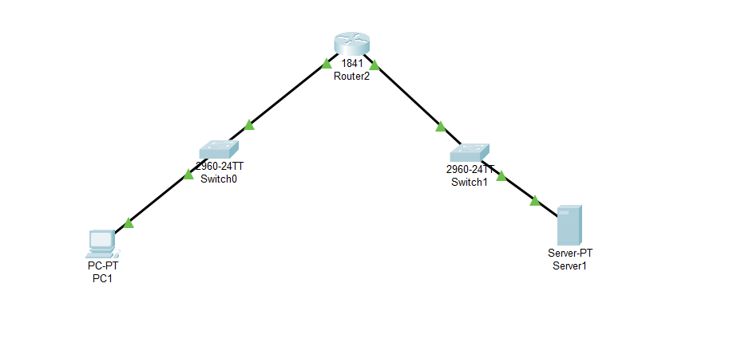

# Building a sandbox with using VirtualBox

Purpose of the Sandboxed Network:
* Create a secure and isolated environment for learning networking concepts.
Simulate real-world network scenarios without risks to live systems.
Task Overview:

* Use VirtualBox to design and configure a private virtual network.
Include multiple Virtual Machines (VMs) to represent network devices.

Key Components:
* PC (PC1): Acts as the user or client system.
* Switches (Switch0 and Switch1): Manage and facilitate communication between devices.
* Router (1841 Router): Ensures connectivity between different parts of the network.
* Server (Server1): Provides network services.

Learning Objectives:
* Understand and apply IP subnetting techniques.
* Configure and manage network interfaces for communication.
* Set up and operate a basic server environment.
* Plan and design an organized network topology.

Outcome:
* Gain practical knowledge of network design, setup, and troubleshooting.
* Develop skills in planning and implementing virtualized networking solutions.
